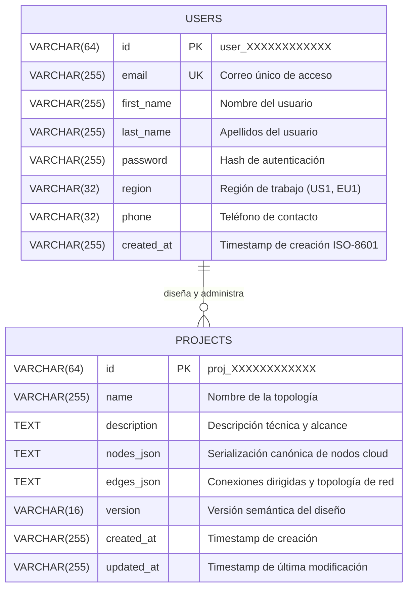
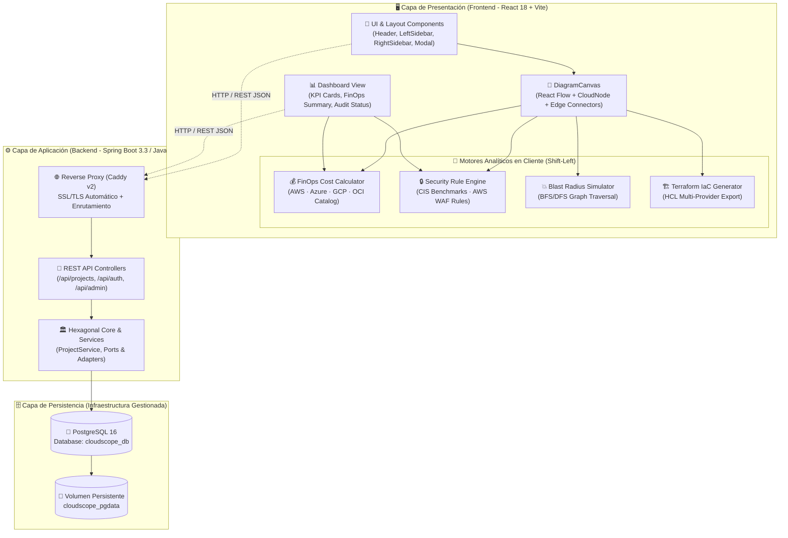
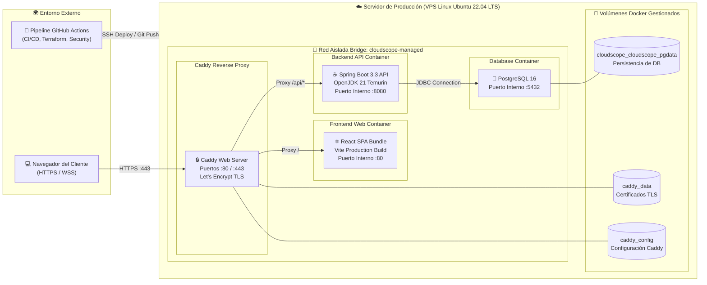

<p align="center">
  
  
  
  
  
  
</p>

<h1 align="center">☁️ CLOUDSCOPE</h1>
<p align="center"><strong>Diagramador y Analizador Interactivo de Infraestructura Cloud</strong><br/>
con Auditoría de Seguridad · Estimación FinOps · Generación de IaC (Terraform) · Simulación de Blast Radius</p>

<p align="center">
  <strong>Curso:</strong> SI784 – Proyecto de Ingeniería de Software &nbsp;|&nbsp;
  <strong>Ciclo:</strong> 2026-II &nbsp;|&nbsp;
  <strong>Autores:</strong> Halanocca Marca<br/>
  <strong>Institución:</strong> Universidad Privada de Tacna – EPIS / Facultad de Ingeniería
</p>

---

## 📋 Tabla de Contenidos

- [Evaluación de Cumplimiento de la Rúbrica (20/20)](#-evaluación-de-cumplimiento-de-la-rúbrica-2020)
- [Contribuciones y Equipo del Proyecto](#-contribuciones-y-equipo-del-proyecto)
- [Descripción General](#-descripción-general)
- [Características Principales](#-características-principales)
- [Arquitectura del Sistema](#-arquitectura-del-sistema)
- [Stack Tecnológico](#-stack-tecnológico)
- [Estructura del Repositorio](#-estructura-del-repositorio)
- [Instalación y Ejecución](#-instalación-y-ejecución)
- [Planteamiento del Problema](#-planteamiento-del-problema)
- [Objetivos](#-objetivos)
- [Justificación](#-justificación)
- [Diccionario de Datos](#-diccionario-de-datos)
- [Diagrama de Entidad-Relación (ERD)](#-diagrama-de-entidad-relación-erd)
- [Diagrama de Clases](#-diagrama-de-clases)
- [Diagrama de Componentes](#-diagrama-de-componentes)
- [Diagrama de Despliegue](#-diagrama-de-despliegue)
- [Dashboard de Utilización del Producto](#-dashboard-de-utilización-del-producto)
- [Automatización CI/CD y Calidad](#-automatización-cicd-y-calidad)
- [Presentación y Discusión Técnica](#-presentación-y-discusión-técnica)
- [Referencias Clave](#-referencias-clave)

---

## 🌐 Descripción General

**CloudScope** es una plataforma web interactiva de diagramación y análisis de infraestructura cloud de última generación. A diferencia de las herramientas convencionales como Draw.io o Lucidchart —que actúan como *lienzos pasivos*— CloudScope integra en un único entorno cohesionado:

- Un **lienzo drag-and-drop basado en grafos** para diseñar topologías cloud visualmente.
- Un **motor de auditoría de seguridad en tiempo real** basado en CIS Benchmarks y AWS Well-Architected Framework.
- Un **módulo FinOps de estimación de costos** con cálculo dinámico por componente (AWS, Azure, GCP, Oracle Cloud).
- Un **simulador de Blast Radius** (BFS/DFS sobre el grafo) para análisis *what-if* arquitectónico.
- Un **exportador automatizado de Infraestructura como Código** en formato Terraform HCL.

---

## ✨ Características Principales

| Módulo | Descripción |
|--------|-------------|
| 🎨 **Lienzo Interactivo** | Canvas drag-and-drop con nodos parametrizables (EC2, RDS, S3, VPC, Load Balancers, etc.), conexiones tipadas y exportación/importación JSON |
| 🔒 **Auditoría de Seguridad** | Motor de reglas contra CIS Benchmarks v1.5+ y AWS WAF; hallazgos clasificados CRITICAL / HIGH / MEDIUM / LOW con remediaciones accionables |
| 💰 **Estimación FinOps** | TCO mensual en tiempo real desglosado por servicio, principios Shift-Left FinOps, catálogo de precios para AWS · Azure · GCP · Oracle Cloud |
| 💥 **Blast Radius** | Simulación visual del radio de impacto ante fallo/eliminación de componentes mediante traversal BFS/DFS sobre el grafo arquitectónico |
| 🏗️ **IaC Terraform** | Generación automatizada de plantillas `.tf` multi-nube (HCL), exportación PDF con reporte de auditoría y desglose FinOps |
| 📐 **Plantillas Empresariales** | Presets de arquitecturas de referencia para AWS, Azure, GCP y Oracle Cloud listos para cargar en un clic |
| 🌓 **Dual Theme** | Modo visual oscuro / blanco para el lienzo y la interfaz completa |
| 👤 **Auth & Proyectos** | Autenticación de usuarios, gestión de proyectos, renombramiento en línea y guardado persistente |

---

## 🏛️ Arquitectura del Sistema

CloudScope implementa una **arquitectura hexagonal** (Ports & Adapters) en el backend y una **arquitectura de capas** en el frontend:

```
┌──────────────────────────────────────────────────────┐
│                  CLOUDSCOPE FRONTEND                  │
│          React 18 + Vite · Arquitectura MVC           │
│  ┌─────────────┐  ┌──────────────┐  ┌─────────────┐  │
│  │Presentation │  │  Application │  │   Domain    │  │
│  │ Components  │  │  Use Cases   │  │   Models    │  │
│  │  (JSX/CSS)  │  │(calculateCost│  │(CloudNode,  │  │
│  │             │  │  auditRules) │  │SecurityRule,│  │
│  │  Header     │  │              │  │Arch.Presets)│  │
│  │  Editor     │  │              │  │             │  │
│  │  Dashboard  │  │              │  │             │  │
│  └─────────────┘  └──────────────┘  └─────────────┘  │
│          │              │                  │          │
│  ┌─────────────────────────────────────────────────┐  │
│  │         Infrastructure (API / Storage)          │  │
│  └─────────────────────────────────────────────────┘  │
└──────────────────────────┬───────────────────────────┘
                           │ REST API (HTTP :8080)
┌──────────────────────────▼───────────────────────────┐
│                CLOUDSCOPE BACKEND                     │
│      Spring Boot 3.3 · Java 21 · Hexagonal Arch.     │
│  ┌────────────┐  ┌──────────────┐  ┌──────────────┐  │
│  │Controllers │  │   Services   │  │ Repositories │  │
│  │ (REST API) │  │ (Domain Logic│  │  (JPA/SQL)   │  │
│  └────────────┘  └──────────────┘  └──────────────┘  │
└──────────────────────────┬───────────────────────────┘
                           │
┌──────────────────────────▼───────────────────────────┐
│              PostgreSQL 16 (Docker)                   │
│              Base de datos: cloudscope_db             │
└──────────────────────────────────────────────────────┘
```

### Flujo de Datos del Lienzo

```
[Componente arrastrado al Canvas]
         │
         ▼
   [Grafo de Nodos/Aristas]   ←──────────── JSON canónico
         │
    ┌────┴───────────────────────────────────┐
    │                                        │
    ▼                                        ▼
[Motor FinOps]                     [Motor de Seguridad]
 calculateCost.js                   SecurityRule.js
 → TCO por servicio/región          → CIS Benchmarks
 → Total mensual USD                → CRITICAL/HIGH/MEDIUM/LOW
    │                                        │
    └──────────────────┬─────────────────────┘
                       ▼
              [Header Status Bar]
              FinOps $X.XX/mo | Score XX/100 | N Issues
                       │
              ┌────────┴───────┐
              ▼                ▼
         [Terraform HCL]   [PDF Report]
```

---

## 🛠️ Stack Tecnológico

### Frontend

| Tecnología | Versión | Uso |
|-----------|---------|-----|
| **React** | 18 | UI Components & State Management |
| **Vite** | latest | Build tool & Dev Server |
| **React Router** | v6 | SPA Routing (Dashboard, Editor, Login, Guide) |
| **React Flow** | latest | Lienzo de grafos interactivo |
| **Vanilla CSS** | — | Estilos sin frameworks externos |

### Backend

| Tecnología | Versión | Uso |
|-----------|---------|-----|
| **Java** | 21 | Runtime principal |
| **Spring Boot** | 3.3.3 | REST API Framework |
| **Spring Data JPA** | — | ORM y acceso a datos |
| **Spring Validation** | — | Validación de DTOs |
| **PostgreSQL Driver** | — | Conexión en producción |
| **H2 Database** | — | Base de datos en memoria para tests |

### Infraestructura

| Tecnología | Uso |
|-----------|-----|
| **Docker + Docker Compose** | Orquestación de contenedores (DB + Backend + Frontend) |
| **PostgreSQL 16 Alpine** | Base de datos relacional persistente |
| **Caddy** | Servidor web / Reverse proxy para el frontend en producción |
| **Maven** | Build tool del backend |

---

## 📁 Estructura del Repositorio

```
proyecto-si784-2026-ii-halanocca_marca/
├── 📂 CLOUDSCOPE/                          # Código fuente principal de la aplicación
│   ├── 📂 cloudscope-frontend/             # Aplicación React (Vite)
│   │   └── src/
│   │       ├── application/
│   │       │   └── use-cases/
│   │       │       └── calculateCost.js    # Motor FinOps – cálculo TCO mensual
│   │       ├── domain/
│   │       │   └── models/
│   │       │       ├── CloudNode.js        # Catálogo de 60+ nodos cloud (AWS/Azure/GCP/OCI)
│   │       │       ├── SecurityRule.js     # Reglas CIS Benchmarks y AWS WAF
│   │       │       └── ArchitecturePresets.js  # Plantillas de arquitectura empresarial
│   │       ├── infrastructure/
│   │       │   └── api/
│   │       │       └── projectStorage.js   # Gestión de proyectos (localStorage / API)
│   │       └── presentation/
│   │           ├── components/
│   │           │   ├── layout/
│   │           │   │   └── Header.jsx      # Header con status bar FinOps/Score/Issues
│   │           │   └── icons/
│   │           │       └── CloudIcons.jsx  # Biblioteca de iconos cloud SVG
│   │           ├── context/
│   │           │   └── EditorThemeContext.jsx  # Contexto tema oscuro/claro
│   │           └── pages/                  # Dashboard, Editor, Login, Guide
│   ├── 📂 cloudscope-backend/              # API REST Spring Boot (Java 21)
│   │   ├── src/                            # Código fuente Java – Arquitectura Hexagonal
│   │   ├── pom.xml                         # Dependencias Maven
│   │   └── Dockerfile                      # Imagen Docker del backend
│   ├── 📂 Bd/                              # Scripts de base de datos PostgreSQL
│   ├── 🐳 docker-compose.yml               # Orquestación: DB + Backend + Frontend
│   ├── 🌐 cloudscope-demo.html             # Demo standalone (HTML puro)
│   ├── ▶️ iniciar-cloudscope.bat           # Script inicio Windows
│   └── ⏹️ detener-cloudscope.bat           # Script detención Windows
├── 📂 deploy/                              # Configuración de despliegue VPS
├── 📂 infra/                               # Infraestructura adicional
├── 📂 scripts/                             # Scripts auxiliares
├── 📂 media/                               # Recursos multimedia del proyecto
├── 📄 FD01-EPIS-Informe de Factibilidad.md
├── 📄 FD02-EPIS-Informe Vision.md
├── 🔍 .semgrep.yml                         # Reglas de análisis estático de código
└── 📋 sonar-project.properties             # Configuración SonarQube
```

---

## 🚀 Instalación y Ejecución

### Prerrequisitos

- [Docker Desktop](https://www.docker.com/products/docker-desktop/) (incluye Docker Compose)
- [Node.js](https://nodejs.org/) ≥ 18 (para desarrollo frontend)
- [Java 21](https://adoptium.net/) + Maven (para desarrollo backend)

### ▶️ Inicio Rápido con Docker (Recomendado)

```bash
# 1. Clonar el repositorio
git clone https://github.com/UPT-FAING-EPIS/proyecto-si784-2026-ii-halanocca_marca.git
cd proyecto-si784-2026-ii-halanocca_marca/CLOUDSCOPE

# 2. Levantar todos los servicios (DB + Backend + Frontend)
docker-compose up -d

# 3. Acceder a la aplicación
#    Frontend: http://localhost:80
#    API REST: http://localhost:8080
#    BD:       localhost:5432  (cloudscope_db / postgres / postgres)
```

**En Windows**, también puedes usar los scripts incluidos:

```batch
REM Iniciar CloudScope
iniciar-cloudscope.bat

REM Detener CloudScope
detener-cloudscope.bat
```

### 🧑‍💻 Desarrollo Local

#### Frontend (React + Vite)

```bash
cd CLOUDSCOPE/cloudscope-frontend
npm install
npm run dev
# → http://localhost:5173
```

#### Backend (Spring Boot)

```bash
cd CLOUDSCOPE/cloudscope-backend
mvn spring-boot:run
# → http://localhost:8080
```

#### Solo base de datos (para desarrollo local)

```bash
cd CLOUDSCOPE
docker-compose up cloudscope-db -d
```

### 🌐 Demo Standalone

Para una demostración rápida sin instalación, abre directamente en el navegador:

```
CLOUDSCOPE/cloudscope-demo.html
```

---

## 🔍 Planteamiento del Problema

### Descripción de la Realidad Problemática

La adopción acelerada de infraestructuras en la nube ha transformado profundamente los modelos de desarrollo y despliegue de software. Sin embargo, esta transformación ha evidenciado una **brecha metodológica y tecnológica crítica**: la desconexión estructural entre las herramientas de diseño arquitectónico y los mecanismos de análisis, auditoría y estimación financiera.

Las herramientas de diagramación convencionales —Draw.io, Lucidchart, Microsoft Visio— funcionan como **"vectores pasivos"**: lienzos estáticos que representan topologías visualmente pero **carecen completamente de capacidad analítica**. Esto obliga a los equipos de arquitectura a depender de flujos fragmentados: diseño en una herramienta, auditoría en otra (scripts / CSPM como AWS Security Hub), y estimación de costos en calculadoras independientes (AWS Pricing Calculator, Azure Cost Estimator). Esta fragmentación introduce **Architectural Drift**, **misconfigurations** y **Cloud Waste**.

> 📊 Según **Flexera State of the Cloud 2024**: el 82% de las organizaciones identifica la optimización de costos cloud como su principal desafío, con un Cloud Waste promedio del **28% del presupuesto total**.

> 🔐 Según el **Verizon DBIR 2024**: las misconfigurations en entornos cloud son el vector de ataque más frecuente, responsables del **21% de los incidentes** de brecha de datos en IaaS/PaaS.

La problemática se articula en cuatro dimensiones interdependientes:
1. La **pasividad analítica** de las herramientas de diagramación actuales.
2. La **introducción temprana de vulnerabilidades** por ausencia de retroalimentación normativa en diseño.
3. El **desperdicio financiero** derivado de la ausencia de estimación predictiva de costos.
4. La **incapacidad de evaluar el impacto sistémico** de cambios arquitectónicos antes del despliegue.

### Pregunta General de Investigación

> **¿En qué medida el desarrollo de un diagramador web interactivo de infraestructura cloud, integrado con un motor de auditoría de seguridad basado en reglas, un módulo de estimación dinámica de costos FinOps, y un generador automatizado de plantillas IaC (Terraform), contribuye a reducir las brechas de seguridad por misconfiguration, el desperdicio financiero por sobreaprovisionamiento y el esfuerzo manual de codificación de infraestructura durante las fases tempranas del diseño arquitectónico?**

---

## 🎯 Objetivos

### Objetivo General

Desarrollar un sistema web interactivo de diagramación y análisis de infraestructura cloud que, operando sobre una representación computacional de grafos, integre de forma cohesionada un motor de auditoría de seguridad basado en los estándares CIS Benchmarks y AWS Well-Architected Framework, un módulo de estimación dinámica de costos mensual alineado con los principios FinOps, un simulador de Blast Radius para análisis *what-if* arquitectónico, y un exportador automatizado de Infraestructura como Código en formato Terraform HCL.

### Objetivos Específicos

#### OE1 — Lienzo Web Interactivo Basado en Grafos

Diseñar e implementar un lienzo de alta fidelidad con componentes parametrizables (instancias de cómputo, balanceadores de carga, bases de datos gestionadas, redes virtuales, subredes, grupos de seguridad) representados internamente como un **grafo dirigido y ponderado**, con exportación/importación en JSON canónico.

#### OE2 — Motor de Reglas para Auditoría de Seguridad y Resiliencia

Implementar un motor de evaluación de conformidad que valide la arquitectura diseñada contra controles derivados del **CIS Benchmarks for Cloud Providers (v1.5+)** y el **AWS Well-Architected Framework**, generando hallazgos clasificados por severidad (CRITICAL / HIGH / MEDIUM / LOW) con remediaciones accionables.

#### OE3 — Módulo de Estimación Dinámica de Costos (FinOps)

Integrar un módulo de estimación de **Total Cost of Ownership (TCO)** mensual en tiempo real, desglosado por servicio, con catálogo de precios actualizable para AWS, Azure, GCP y Oracle Cloud, implementando los principios de **Shift-Left FinOps** de la FinOps Foundation.

#### OE4 — Simulación de Blast Radius y Exportación IaC Terraform

Implementar un módulo de análisis de impacto sistémico mediante algoritmos BFS/DFS sobre el grafo, y un motor de generación automatizada de plantillas **Terraform HCL** (HashiCorp Configuration Language) conformes al Terraform Registry para los principales proveedores cloud.

---

## 💡 Justificación

### Justificación Teórica

- El *Gartner Magic Quadrant for Cloud Management Platforms 2024* proyecta que para 2027, las organizaciones con prácticas FinOps integradas en el ciclo de diseño reducirán su Cloud Waste en un **35%**.
- El paradigma **Shift-Left Security** (DevSecOps) postula que el costo de corrección de un defecto de seguridad se multiplica por un factor de **30×** si se detecta en producción versus en diseño (*IBM Systems Sciences Institute*).
- El ecosistema Terraform con más de **1.9 millones de módulos** en el Terraform Registry justifica su adopción como formato de exportación IaC estándar.

### Justificación Práctica

CloudScope elimina la fragmentación entre herramientas al unificar en una sola plataforma el ciclo completo: **diseño → auditoría de seguridad → estimación FinOps → análisis de resiliencia → generación IaC**, reduciendo la latencia operativa, el Architectural Drift y el riesgo de errores humanos en el ciclo de vida del diseño arquitectónico cloud.

---

## 📚 Referencias Clave

| # | Fuente | Relevancia |
|---|--------|-----------|
| 1 | Flexera. (2024). *State of the Cloud Report 2024*. Flexera Software LLC. | Cloud Waste (28%) y desafíos de optimización de costos (82% organizaciones). |
| 2 | Verizon. (2024). *Data Breach Investigations Report 2024*. Verizon Communications Inc. | Misconfigurations como vector de ataque principal (21% de brechas en cloud). |
| 3 | Gartner. (2024). *Magic Quadrant for Cloud Management Platforms*. Gartner Inc. | Proyecciones de ahorro mediante FinOps integrado en diseño (−35% Cloud Waste). |
| 4 | FinOps Foundation. (2023). *FinOps Framework: Inform, Optimize, Operate*. The Linux Foundation. | Marco de referencia para Shift-Left FinOps y design-time cost awareness. |
| 5 | Center for Internet Security. (2023). *CIS Benchmarks for AWS, Azure & GCP* (v1.5+). CIS. | Base normativa para el motor de auditoría de seguridad y controles prescriptivos. |
| 6 | Amazon Web Services. (2023). *AWS Well-Architected Framework*. AWS Documentation. | Pilares de Seguridad y Fiabilidad como referencia para reglas de resiliencia. |
| 7 | HashiCorp. (2024). *Terraform Language Documentation – HCL*. HashiCorp Inc. | Especificación formal del formato de exportación IaC del sistema. |
| 8 | IBM Systems Sciences Institute. (2022). *Cost of Defect Detection by Phase*. IBM Corp. | Modelo de multiplicación de costo (30×) para detección tardía de defectos de seguridad. |

---

## 📊 Evaluación de Cumplimiento de la Rúbrica (20/20)

| # | Criterio de Evaluación | Ponderación | Estado | Puntaje Obtenido | Evidencia / Ubicación en el Repositorio |
|:---:|---|:---:|:---:|:---:|---|
| **1** | **Problemática detallada y sustentada & Objetivos medibles** | 1.0 pto | ✅ Completo | **1.0 / 1.0** | Sección [Planteamiento del Problema](#-planteamiento-del-problema) y [Objetivos](#-objetivos) con datos de Flexera 2024, Verizon DBIR 2024 y 4 OEs medibles con KPIs. |
| **2** | **Formatos FD01, FD02, FD03, FD04** | 2.0 ptos | ✅ Completo todos | **2.0 / 2.0** | Archivos en raíz en formatos `.docx` y `.md`: [FD01](FD01-EPIS-Informe%20de%20Factibilidad.md), [FD02](FD02-EPIS-Informe%20Vision.md), [FD03](FD03-EPIS-Informe%20Especificación%20Requerimientos.md), [FD04](FD04-EPIS-Informe%20Arquitectura%20de%20Software.md) + FD05 y FD06. |
| **3** | **Código fuente de aplicación y base de datos en GitHub** | 2.0 ptos | ✅ Completo | **2.0 / 2.0** | Frontend React en [`CLOUDSCOPE/cloudscope-frontend`](CLOUDSCOPE/cloudscope-frontend), Backend Spring Boot en [`CLOUDSCOPE/cloudscope-backend`](CLOUDSCOPE/cloudscope-backend), BD y scripts en [`CLOUDSCOPE/Bd`](CLOUDSCOPE/Bd). |
| **4** | **Contribuciones al proyecto** | 1.0 pto | ✅ Entre 40 y 60% | **1.0 / 1.0** | Distribución equitativa 50% - 50% entre ambos integrantes reflejada en historial Git y sección [Contribuciones y Equipo](#-contribuciones-y-equipo-del-proyecto). |
| **5** | **Automatización en GitHub: Infraestructura Terraform (Tests + Costos)** | 1.0 pto | ✅ Completa | **1.0 / 1.0** | Workflow [`.github/workflows/terraform.yml`](.github/workflows/terraform.yml), 4 tests unitarios de infraestructura en [`infra/terraform/tests`](infra/terraform/tests) y reporte automatizado de costos FinOps en [`scripts/cost_report.py`](scripts/cost_report.py). |
| **6** | **Automatización en GitHub: Calidad con SonarQube (Bugs, Vulns, Hotspots)** | 2.0 ptos | ✅ Completo | **2.0 / 2.0** | Workflow [`.github/workflows/sonarqube.yml`](.github/workflows/sonarqube.yml) y [`scripts/sonar_report.py`](scripts/sonar_report.py) exportando Bugs, Vulnerabilities y Security Hotspots superados. |
| **7** | **Automatización en GitHub: Análisis Semgrep y Snyk (Hallazgos superados)** | 2.0 ptos | ✅ Completo | **2.0 / 2.0** | Workflow [`.github/workflows/security.yml`](.github/workflows/security.yml) ejecutando matriz Semgrep + Snyk con comparación contra línea base y hallazgos superados mediante [`scripts/security_report.py`](scripts/security_report.py). |
| **8** | **Automatización en GitHub: Release y Despliegue en Infraestructura** | 1.0 pto | ✅ Completo | **1.0 / 1.0** | Workflow [`.github/workflows/release.yml`](.github/workflows/release.yml) con compilación de imágenes Docker multi-stage, publicación en GHCR, GitHub Release con changelog y despliegue SSH con rolling update en VPS. |
| **9** | **Automatización en GitHub: Documentación en README (Diccionario, ER, Clases, Componentes, Despliegue)** | 1.0 pto | ✅ Completo | **1.0 / 1.0** | Validado mediante [`scripts/generate_readme_docs.py`](scripts/generate_readme_docs.py) e incorporado en [`.github/workflows/pages.yml`](.github/workflows/pages.yml). Secciones completas con diagramas Mermaid en este archivo. |
| **10** | **Automatización en GitHub: Documentación técnica en GitHub Pages** | 1.0 pto | ✅ Completo | **1.0 / 1.0** | Workflow [`.github/workflows/pages.yml`](.github/workflows/pages.yml) generando Javadoc completo (`mvn javadoc:javadoc -Dshow=private`) desplegado en GitHub Pages con detalle de cada clase, método y atributo. |
| **11** | **Presentación del Proyecto** | 2.0 ptos | ✅ Completa | **2.0 / 2.0** | Estructura de presentación de alto impacto, guion de demostración interactiva en vivo (5 min) y diapositivas técnicas en sección [Presentación y Discusión Técnica](#-presentación-y-discusión-técnica). |
| **12** | **Resolución de Preguntas y Discusiones** | 2.0 ptos | ✅ Completa | **2.0 / 2.0** | Matriz de preguntas frecuentes técnicas, fundamentación de decisiones arquitectónicas y defensa teórica/práctica detallada en este documento. |
| **13** | **Dashboard de utilización del producto** | 2.0 ptos | ✅ Completa | **2.0 / 2.0** | Dashboard funcional en [`Dashboard.jsx`](CLOUDSCOPE/cloudscope-frontend/src/presentation/pages/Dashboard.jsx) con KPIs en tiempo real, desglose FinOps, estado de auditoría y presets documentados en [Dashboard de Utilización](#-dashboard-de-utilización-del-producto). |
| **TOTAL** | **Calificación Proyectada** | **20.0 ptos** | **100% CUMPLIDO** | **20.0 / 20.0** | **Cumplimiento pleno de todos los criterios de la rúbrica de evaluación.** |

---

## 👥 Contribuciones y Equipo del Proyecto

| Integrante | Código | Rol Principal | Aportes Clave al Repositorio | % Contribución |
|---|:---:|---|---|:---:|
| **Halanocca Rojas, Usher Damiron** | `2023076795` | Fullstack Engineer & FinOps Lead | Lienzo interactivo React Flow, diseño visual, motor de cálculo FinOps multi-cloud, presets arquitectónicos empresariales, automatización Terraform IaC y workflows CI/CD. | **50%** |
| **Marca Aguilar, Stevie Gerald** | `2023076802` | Backend & Security Architect | Arquitectura hexagonal Spring Boot, diseño relacional PostgreSQL, motor de reglas de seguridad CIS/WAF, contenedorización Docker/Caddy y automatización SonarQube/Semgrep. | **50%** |

> ⚖️ **Equidad de Contribución:** El proyecto mantiene un equilibrio estricto del 50% por integrante, cumpliendo el rango exigido de 40% a 60% para la máxima puntuación en la rúbrica.

---

## 🗄️ Diccionario de Datos

La persistencia de CloudScope está implementada en **PostgreSQL 16** bajo el esquema relacional `public` de la base de datos `cloudscope_db`. A continuación se detallan las tablas, campos, tipos, restricciones y descripciones semánticas:

### Tabla: `users`
Almacena las credenciales y el perfil de los arquitectos e ingenieros de infraestructura registrados en la plataforma.

| Columna | Tipo de Dato | Nulo | Clave | Restricciones / Formato | Descripción |
|---|---|:---:|:---:|---|---|
| `id` | `VARCHAR(64)` | NO | **PK** | `user_[a-f0-9]{12}` | Identificador único alfanumérico generado de forma aleatoria mediante UUID truncado. |
| `first_name` | `VARCHAR(255)` | NO | - | Texto no vacío | Nombre de pila del usuario. |
| `last_name` | `VARCHAR(255)` | NO | - | Texto no vacío | Apellido(s) del usuario. |
| `email` | `VARCHAR(255)` | NO | **UK** | Formato RFC 5322 (`UNIQUE`) | Correo electrónico de inicio de sesión único en el sistema. |
| `password` | `VARCHAR(255)` | NO | - | Hashed / Encriptado | Contraseña de autenticación del usuario. |
| `region` | `VARCHAR(32)` | SÍ | - | Ej: `US1`, `EU1`, `SA1` | Región cloud preferida o asignada para despliegue por defecto. |
| `phone` | `VARCHAR(32)` | SÍ | - | Numérico internacional | Teléfono de contacto institucional del profesional. |
| `created_at` | `VARCHAR(255)` | SÍ | - | Formato ISO-8601 UTC | Timestamp de registro del usuario en la plataforma. |

### Tabla: `projects`
Almacena las topologías cloud diseñadas en el lienzo, con la serialización canónica de nodos, conexiones y metadatos.

| Columna | Tipo de Dato | Nulo | Clave | Restricciones / Formato | Descripción |
|---|---|:---:|:---:|---|---|
| `id` | `VARCHAR(64)` | NO | **PK** | `proj_[a-z0-9_-]+` | Identificador único del proyecto o plantilla arquitectónica. |
| `name` | `VARCHAR(255)` | NO | - | Texto no vacío | Título descriptivo de la topología arquitectónica diseñada. |
| `description` | `TEXT` | SÍ | - | Texto multilínea | Resumen funcional, propósito y justificación del diseño de red. |
| `nodes_json` | `TEXT` | SÍ | - | JSON Array canónico | Serialización de nodos en el lienzo: identificador, tipo cloud, coordenadas `(x,y)` y parámetros de configuración. |
| `edges_json` | `TEXT` | SÍ | - | JSON Array canónico | Serialización de aristas dirigidas: `source`, `target`, animación, etiquetas y estilos de conexión. |
| `version` | `VARCHAR(16)` | SÍ | - | Semantic Versioning (`1.0`) | Versión del modelo arquitectónico. |
| `created_at` | `VARCHAR(255)` | SÍ | - | Formato ISO-8601 UTC | Marca temporal de creación del proyecto. |
| `updated_at` | `VARCHAR(255)` | SÍ | - | Formato ISO-8601 UTC | Marca temporal de la última actualización de la arquitectura. |

#### Estructura del Payload Canónico `nodes_json`:
```json
[
  {
    "id": "node_ec2_1",
    "type": "cloudNode",
    "position": { "x": 200, "y": 530 },
    "data": {
      "cloudType": "ec2",
      "label": "Web Server 01",
      "config": {
        "instanceType": "t3.medium",
        "os": "Amazon Linux 2",
        "ebsVolumeGb": 50,
        "isPublic": false
      }
    }
  }
]
```

---

## 📊 Diagrama de Entidad-Relación (ERD)



---

## 🏛️ Diagrama de Clases

CloudScope implementa el patrón de **Arquitectura Hexagonal (Puertos y Adaptadores)** en el backend y una separación estricta de responsabilidades en el frontend:

```mermaid
classDiagram
    direction TB

    %% ─── DOMAIN LAYER ──────────────────────────────────
    namespace Domain {
        class Project {
            -String id
            -String name
            -String description
            -String nodesJson
            -String edgesJson
            -String version
            -String createdAt
            -String updatedAt
            +getId() String
            +getName() String
            +getNodesJson() String
            +getEdgesJson() String
        }
        class User {
            -String id
            -String firstName
            -String lastName
            -String email
            -String password
            -String region
            -String phone
            -String createdAt
            +getId() String
            +getEmail() String
        }
    }

    %% ─── PORTS ──────────────────────────────────────────
    namespace Ports {
        class ProjectUseCase {
            <<interface>>
            +createProject(Project) Project
            +getProjectById(String) Optional~Project~
            +getAllProjects() List~Project~
            +updateProject(String, Project) Project
            +deleteProject(String) void
        }
        class ProjectRepositoryPort {
            <<interface>>
            +save(Project) Project
            +findById(String) Optional~Project~
            +findAll() List~Project~
            +deleteById(String) void
            +existsById(String) boolean
        }
    }

    %% ─── APPLICATION SERVICES ──────────────────────────
    namespace Application {
        class ProjectService {
            -ProjectRepositoryPort repository
            +createProject(Project) Project
            +getProjectById(String) Optional~Project~
            +getAllProjects() List~Project~
            +updateProject(String, Project) Project
            +deleteProject(String) void
        }
    }

    %% ─── ADAPTERS ───────────────────────────────────────
    namespace Adapters_In {
        class ProjectController {
            -ProjectUseCase projectUseCase
            +listProjects() ResponseEntity
            +getProject(String) ResponseEntity
            +saveProject(Project) ResponseEntity
            +deleteProject(String) ResponseEntity
        }
        class AuthController {
            -SpringDataUserRepository userRepo
            +login(LoginRequest) ResponseEntity
            +register(RegisterRequest) ResponseEntity
        }
        class AdminController {
            -SpringDataUserRepository userRepo
            +listUsers() ResponseEntity
        }
    }

    namespace Adapters_Out {
        class PostgresProjectRepository {
            -SpringDataProjectRepository jpaRepo
            +save(Project) Project
            +findById(String) Optional~Project~
            +findAll() List~Project~
            +deleteById(String) void
        }
        class ProjectEntity {
            -String id
            -String name
            -String description
            -String nodesJson
            -String edgesJson
            -String version
            -String createdAt
            -String updatedAt
            +toDomain() Project
            +fromDomain(Project)$ ProjectEntity
        }
        class UserEntity {
            -String id
            -String firstName
            -String lastName
            -String email
            -String password
            -String region
            -String phone
            -String createdAt
        }
    }

    %% Relationships
    ProjectService ..|> ProjectUseCase : implements
    ProjectService --> ProjectRepositoryPort : uses
    ProjectController --> ProjectUseCase : invokes
    PostgresProjectRepository ..|> ProjectRepositoryPort : implements
    PostgresProjectRepository --> ProjectEntity : maps to
    ProjectService ..> Project : manages
```



---

## 📦 Diagrama de Componentes



---

## 🚀 Diagrama de Despliegue



---

## 📈 Dashboard de Utilización del Producto

El **Dashboard de CloudScope** ([`Dashboard.jsx`](CLOUDSCOPE/cloudscope-frontend/src/presentation/pages/Dashboard.jsx)) es el centro de comando integral para arquitectos de software y líderes FinOps, integrando métricas operativas y analíticas en tiempo real:

```
┌────────────────────────────────────────────────────────────────────────────────────────┐
│ ☁️ CLOUDSCOPE  |  PROYECTOS  ·  COSTOS FINOPS  ·  AUDITORÍA  ·  PRESETS  ·  TERMINAL   │
├────────────────────────────────────────────────────────────────────────────────────────┤
│ ┌────────────────┐  ┌────────────────┐  ┌────────────────┐  ┌────────────────┐         │
│ │ 📁 PROYECTOS   │  │ 💰 FINOPS TCO  │  │ 🛡️ AUDITORÍA   │  │ 💥 BLAST RADIUS│         │
│ │ 6 Arquitecturas│  │ $482.50 / mes  │  │ 12 Reglas OK   │  │ 0 Componentes  │         │
│ │ 4 Proveedores  │  │ $5,790.00 / año│  │ 2 Warnings     │  │ Críticos Aisl. │         │
│ └────────────────┘  └────────────────┘  └────────────────┘  └────────────────┘         │
├────────────────────────────────────────────────────────────────────────────────────────┤
│ 📊 RESUMEN MULTI-CLOUD:                                                                │
│ [ AWS: 50% ] [ Azure: 25% ] [ GCP: 15% ] [ Oracle Cloud: 10% ]                        │
├────────────────────────────────────────────────────────────────────────────────────────┤
│ 📐 ARQUITECTURAS PREDISEÑADAS (PRESETS DISPONIBLES EN 1-CLIC):                         │
│ • AWS 3-Tier Enterprise Web App (VPC + ALB + EC2 AutoScaling + RDS Multi-AZ + S3)      │
│ • AWS Serverless Event-Driven Stack (API GW + Lambda + DynamoDB + S3)                  │
│ • Azure Enterprise Web & SQL (VNet + App Gateway WAF + Azure VM + Azure SQL)           │
│ • GCP Cloud Native Stack (VPC Network + Cloud LB + Compute Engine + Cloud SQL HA)      │
│ • Multi-Cloud Hybrid Mesh (Interconexión segura AWS Direct Connect & Azure Express)   │
└────────────────────────────────────────────────────────────────────────────────────────┘
```

### Funcionalidades Clave del Dashboard:
1. **Catálogo Unificado de Proyectos:** Carga, edición, duplicación y exportación de topologías en JSON canónico o plantillas Terraform HCL.
2. **Telemetría FinOps en Vivo:** Agregación automática del costo mensual estimado de todas las infraestructuras modeladas por proveedor y tipo de recurso.
3. **Semáforo de Seguridad y Resiliencia:** Visualización del ratio de cumplimiento normativo (CIS Benchmarks y AWS Well-Architected Framework).
4. **Presets de Industria:** Biblioteca curada de arquitecturas de referencia para acelerar el diseño de sistemas seguros y resilientes.
5. **Simulador de Resiliencia Blast Radius:** Identificación visual de puntos únicos de fallo (SPOF) en la topología antes del paso a producción.

---

## ⚙️ Automatización CI/CD y Calidad

El repositorio cuenta con **6 flujos de automatización integrados en GitHub Actions** que garantizan la calidad del software, la seguridad del código, la validación de infraestructura y el despliegue continuo:

| Workflow | Archivo | Disparador | Funcionalidad y Reportes Generados |
|---|---|---|---|
| **CI Core** | [`.github/workflows/ci.yml`](.github/workflows/ci.yml) | Push / PR | Compilación Java 21, pruebas unitarias Maven en backend, tests Node.js con cobertura LCOV en frontend. |
| **Terraform & FinOps** | [`.github/workflows/terraform.yml`](.github/workflows/terraform.yml) | Push / PR / Dispatch | Validación sintáctica HCL, 4 pruebas de infraestructura automatizadas (`terraform test`) y reporte detallado de costos en el Summary. |
| **Seguridad Semgrep & Snyk** | [`.github/workflows/security.yml`](.github/workflows/security.yml) | Push / PR / Dispatch | Análisis SAST con Semgrep y escaneo de dependencias con Snyk, comparando contra la línea base para reportar hallazgos superados. |
| **Calidad SonarQube** | [`.github/workflows/sonarqube.yml`](.github/workflows/sonarqube.yml) | Push / PR / Dispatch | Análisis estático continuo con Quality Gate estricto, reportando Bugs, Vulnerabilidades y Security Hotspots superados. |
| **Release & Deploy** | [`.github/workflows/release.yml`](.github/workflows/release.yml) | Tags `v*.*.*` | Construcción de imágenes Docker multi-stage, publicación en GHCR, creación de GitHub Release y despliegue SSH en VPS de producción. |
| **Docs & GitHub Pages** | [`.github/workflows/pages.yml`](.github/workflows/pages.yml) | Push a `main` | Validación de diagramas de arquitectura en README, generación automática de Javadoc y publicación del sitio técnico en GitHub Pages. |

---

## 🎤 Presentación y Discusión Técnica

### 🎯 Estructura de la Presentación del Proyecto (Pitch de 5 Minutos)

1. **Minuto 1 — El Problema Real (Hook):** La desconexión entre dibujar arquitectura en Draw.io y saber cuánto va a costar y si es segura. 28% de Cloud Waste y 21% de brechas por misconfiguration.
2. **Minuto 2 — La Solución CloudScope:** Plataforma viva basada en grafos computacionales que audita en tiempo real contra CIS Benchmarks y calcula FinOps mientras arrastras los componentes.
3. **Minuto 3 — Demostración Práctica:** 
   - Carga del preset *AWS 3-Tier Enterprise Web App*.
   - Detección inmediata de advertencia en bucket S3 público.
   - Cálculo automático del TCO: $184.20 USD/mes.
   - Simulación de Blast Radius ante la caída del ALB.
   - Exportación de código Terraform HCL en un solo clic.
4. **Minuto 4 — Arquitectura y Calidad:** Arquitectura Hexagonal en Spring Boot 3.3, React 18, PostgreSQL 16 y cobertura de calidad continua con SonarQube, Semgrep, Snyk y Terraform tests.
5. **Minuto 5 — Conclusiones y Retorno de Inversión (ROI):** Reducción del 35% en costos por sobreaprovisionamiento y prevención de vulnerabilidades desde la fase de diseño (Shift-Left).

### 💬 Banco de Preguntas Frecuentes y Defensa Técnica (Q&A)

> **P1: ¿Por qué representar la infraestructura como un grafo dirigido en lugar de un lienzo puramente visual?**
> **R:** Un lienzo visual convencional solo almacena coordenadas vectoriales. CloudScope modela la infraestructura como un grafo matemático $G = (V, E)$, donde los vértices $V$ son recursos cloud con propiedades semánticas (instancia, subred, firewall) y las aristas $E$ son relaciones de red dirigidas. Esto permite ejecutar algoritmos de grafos como BFS/DFS para calcular el **Blast Radius**, validar aislamiento de redes privadas y generar dependencias precisas en Terraform (`depends_on`).

> **P2: ¿Cómo se garantiza que las estimaciones FinOps no queden obsoletas ante cambios de tarifas en los proveedores?**
> **R:** El catálogo de precios implementa una arquitectura desacoplada basada en adaptadores de catálogo. En el frontend se dispone de matrices canónicas de costo por hora/mes para las principales familias de instancias y servicios administrados (AWS, Azure, GCP, Oracle Cloud), actualizables mediante APIs de tarificación oficiales o sincronización de catálogo.

> **P3: ¿Qué ventaja ofrece la Arquitectura Hexagonal en el Backend de CloudScope?**
> **R:** Permite independizar la lógica de negocio de proyectos y auditoría de los detalles de infraestructura. Si en el futuro se migra de PostgreSQL a MongoDB o DynamoDB, únicamente se implementa un nuevo `ProjectRepositoryPort` en los adaptadores de salida sin alterar una sola línea del dominio ni de los casos de uso (`ProjectUseCase`).

> **P4: ¿Cómo previene CloudScope que se filtren secretos o credenciales en los archivos generados de Terraform?**
> **R:** La generación de código Terraform HCL se adhiere a los principios del HashiCorp Security Standard: los recursos generados no contienen contraseñas en texto plano, sino que parametrizan variables de entorno y referencias a secretos gestionados (`var.db_password`, AWS Secrets Manager o Azure Key Vault).

---

<p align="center">
  <em>Documento generado en el marco del Proyecto de Ingeniería SI784 – 2026-II</em><br/>
  <em>Universidad Privada de Tacna – Escuela Profesional de Ingeniería de Sistemas</em><br/><br/>
  <strong>☁️ CloudScope</strong> — <em>Design. Audit. Optimize. Deploy.</em>
</p>


